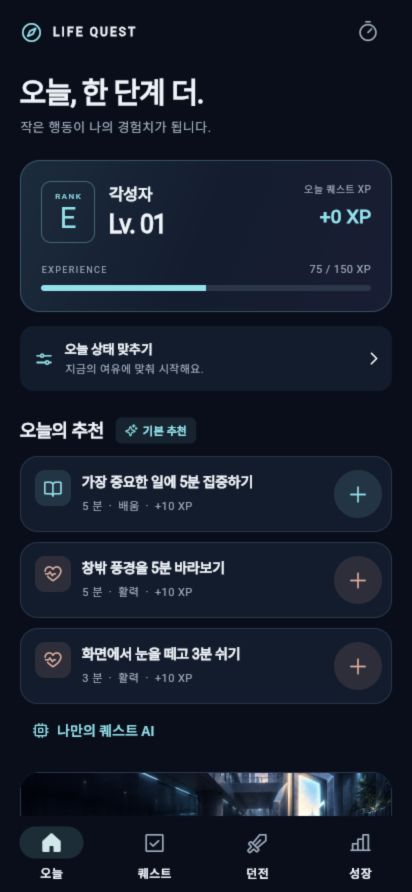
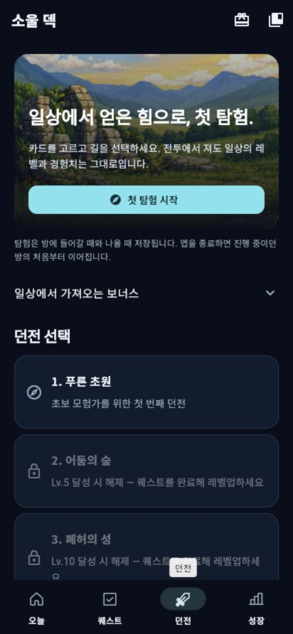
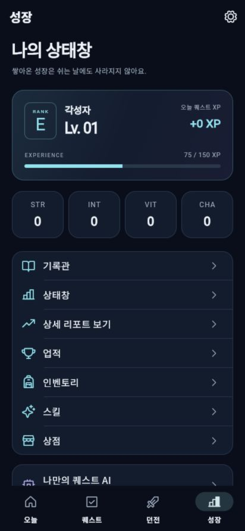
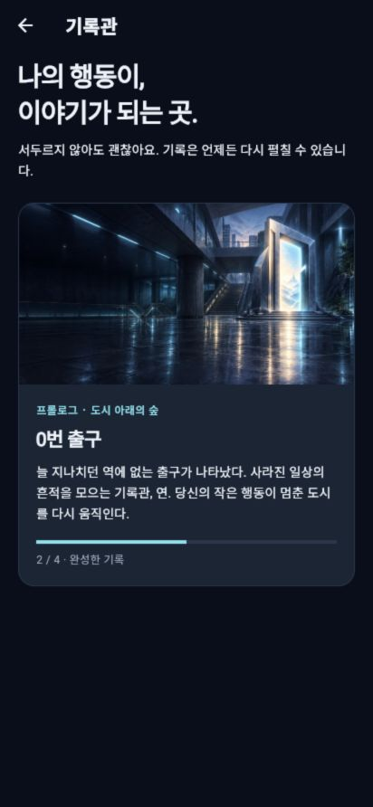

# 콘셉트 검토 · 2026-09-20

현재 release web을 CUA로 실제 조작하여 캡처했다. Android 자체의 입력·스크린리더·성능 감사는 아니다. 합성 테스트 프로필이다.

| 단계 | 관찰과 상태 | 조치 |
|---|---|---|
| 1. 오늘 | 추천은 실제 행동·시간·보상으로 읽기 쉽다. 큰 E등급 카드와 추천 3개 아래에 이야기 입구가 묻힌다. | E등급 제거, 상태 요약 축소, 선택한 책의 다음 장면 진행을 위로 이동 |
| 2. 탐험 | 첫 시작과 저장 규칙이 보인다. 생활 앱과 별개인 ‘소울 덱’ 명칭, 푸른 초원 등 일반 전투 콘텐츠가 지배한다. | ‘카드 탐험’으로 역할 명시, 선택형 부가 활동 유지. 이번 개편에서 전투 전체를 다시 만들지는 않음 |
| 3. 성장 | 쉬어도 진행 보존 문구는 좋다. STR/INT/VIT/CHA만으로는 실제 생활과 의미를 연결하기 어렵다. | 분야 이름을 함께 제시, 실제 완료 기록을 상태창에 포함 |
| 4. 기록관 | 회차·선택·재독 구조는 동작한다. 콘텐츠가 도시 게이트 단편 하나여서 세계관 선택권과 판매 근거가 부족하다. | 동등한 세 무료 단편, 오늘 표시할 책 선택, 다음 장면 바로 이어 읽기 |

## 현재 화면 근거

접근성: 수락 버튼에는 의미 이름이 있고 하단 탐색이 읽힌다. 상태창의 영어 RANK/EXPERIENCE, 작은 보조 문구, 반복되는 같은 강조색은 이해·가독성 위험이다. 큰 글자 및 네 언어 화면 테스트를 변경 범위에 적용한다. 스크린샷만으로 WCAG 준수를 주장하지 않는다.

제품·가격 결정의 근거는 [CONCEPT_AND_REVENUE.md](CONCEPT_AND_REVENUE.md). 기존 2026-09-17 검증은 기준선이고 이번 변경의 회귀 검증을 대신하지 않는다.

## 적용 후 검증

같은412×892 브라우저에서 현재 빌드를 실제 조작했다. 큰 전체 표지 목록은 첫 세계만 두드러져, 표지 썸네일·장르·제목·진척·시작 버튼으로 다시 줄였다. 세 세계를 첫 화면에서 함께 비교할 수 있다. 이어 읽기로 직접 진입한 화면의 ‘이 장의 기록 보기’는 실제 장 목록으로 이동하도록 고쳤다.

| 단계 | 적용과 검증 | 실제 화면 |
|---|---|---|
| 1. 오늘 | 간결한 레벨·XP, 추천 위의 선택한 책, 다음 장면까지 남은 현실 퀘스트 수 | [오늘](screens/concept-review/06-today-after.png) |
| 2. 탐험 | 카드 탐험이라는 기능 이름, 저장·패배 시 보존 설명 유지. 게임 밸런스 전체 재검증 완료로 보지 않음 | [탐험](screens/concept-review/10-expedition-after.png) |
| 3. 성장 | 분야명과 실제 완료 수. 기본명 ‘기록자’, 기존 사용자가 정한 이름은 보존 | [성장](screens/concept-review/09-growth-after.png) |
| 4. 서가 | 세 무료 단편 동등 선택, 완료 수와 현재 책 구분, 이전 선택을 반영한 읽기 | [서가](screens/concept-review/07-library-after.png), [읽기](screens/concept-review/08-atlas-reader-after.png) |

[첫 화면](screens/concept-review/05-welcome-after.png)은 새 image_gen 기록장 아트와 세 세계의 약속을 설명한다. 최종 스크린샷은 저장 후 실제 열어 확인했다. Android Play용 휴대전화 캡처로 제출하지 않았다.

동작 검증: 수련 첫 장면 선택 → 현실 퀘스트1개 완료 → 두 번째 장면 열림과 이전 선택 대사 확인 → 두 번째 선택 저장 → 새로고침 → 같은 책2/4와 퀘스트 기록 복구 → 탐사 책 선택 → 수련 진행 보존. 합성 테스트 데이터만 사용했다.

정적 분석 문제 없음. Flutter 전체**300개 통과**. 세 권×네 언어의 실제 선택 버튼을320px/200%에서 조작하고, 직접 읽기→다음 장면→장 목록 이동을 검사했다. 저장 실패 롤백, 재시작, 백업에 선택한 책을 보존하는 검사도 포함한다. 최초 전체 실행의 영어 큰 글자1건은 스크롤 정착 전 화면 밖을 탭한 테스트 문제였으며, 버튼이 실제 hit-test 가능한지 확인한 뒤 전체 재실행에서 통과했다.

남은 품질 범위: 실물 Android 입력·TalkBack·모델 성능,5구역 게임 밸런스, 유료 본편 집필/검수와 판매 동선, legacy cloud 계정 삭제의 접수 후 로컬 실패 처리는 별도 출시 차단 항목이다. 스크린샷이나300개 테스트만으로 ‘완벽’ 또는 출시 승인이라고 주장하지 않는다.
