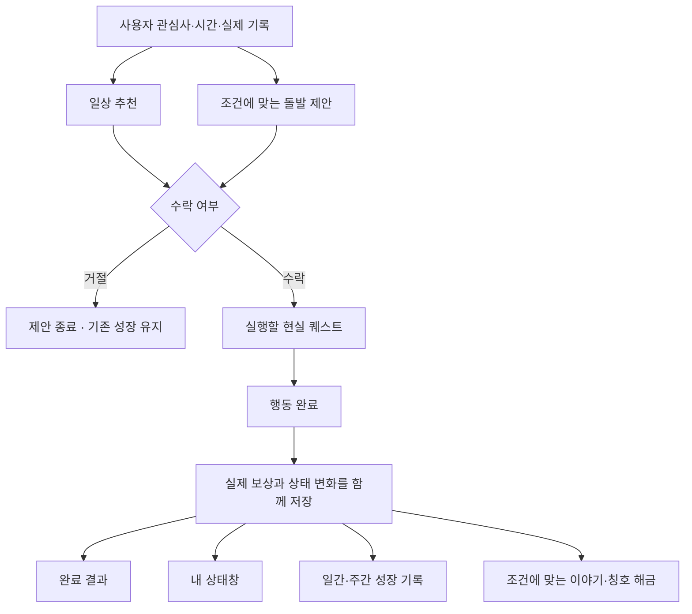

# Life Quest 전체 개선 구조안 · 2026-09-21

**구조 설계만 진행. 구현 보류.** 사용자가 요청한 범위는 지난 점검에서 발견한 문제 전체와 새 돌발 퀘스트를 함께 설계하는 것이다. 이 문서가 전체 구조이고, [돌발 퀘스트 상세](SYSTEM_QUEST_STRUCTURE.md)는 하위 설계다. 화면 배치와 용어도 초안이며 완성된 디자인/작동 기능을 뜻하지 않는다.

## 1. 제품의 약속과 한 번의 사용

**웹툰·웹소설 속 상태창을 자기 일상에서 경험한다.** 사용자가 실제로 할 수 있는 행동을 선택하고, 완료 후 자신에게 쌓인 변화를 확인한다. 앱이 사건을 제안하더라도 사용자가 수락 여부를 결정한다.

기본 흐름은 **내 상태 확인 → 퀘스트 선택/수락 → 현실에서 행동 → 완료 → 성장 결과 → 상태창에 변화 반영**이다. 돌발 퀘스트는 이 흐름에 들어오는 특별한 제안이고, 서가/이야기는 행동으로 이어지는 부가 경험이다.

첫 사용은 간단한 이름과 관심 분야/가용 시간 설정 → 상태창 → 작은 퀘스트 하나의 순서로 설계한다. 모델 설치, 세계관 선택, 전투 준비가 첫 현실 퀘스트를 막지 않게 한다. 초기 스탯 수치는 캐릭터의 게임 기록임을 설명한다. 실제 지능·건강·성격 검사 결과처럼 표현하지 않는다.

## 2. 발견한 문제와 함께 고칠 구조

| 현재 문제 | 제안하는 구조 | 이후 확인할 결과 |
| --- | --- | --- |
| 첫 화면에서 이야기 진행이 앱의 핵심처럼 보임 | 상태창·오늘의 변화·진행 중 퀘스트를 먼저 배치 | 첫 화면에서 내 현재 상태와 다음 행동을 설명할 수 있음 |
| 오늘/성장/상세 상태창에 같은 정보가 분산 | 하나의 상태창과 상세 보기로 통합 | 같은 XP/능력치를 확인하려고 여러 탭을 거치지 않음 |
| 완료 후 짧은 알림만 표시 | 행동·보상·성장 기여·다음 단계가 있는 결과 카드 | 무엇 때문에 무엇이 달라졌는지 즉시 알 수 있음 |
| 기본XP +10과 실제 지급 +11의 표시 불일치 | 실제 지급 내역을 공통 성장 기록에 저장하고 모든 화면이 참조 | 미리 본 보상, 완료 결과, 오늘 합계가 같은 기준으로 일치 |
| 월요일 완료가 주간 통계에서 누락 | 날짜의 시작/끝을 공통 규칙으로 정의하고 완료 기록을 집계 | 월요일0시·일요일 말·미래 시각 등의 경계 검증 |
| 어제 대비 변화가 바로 보이지 않음 | 실제 기록을 기준으로 하루 변화와 전일 마감 대비 상태 변화 제공 | 일별XP, 완료 수, 레벨/능력치 변화를 근거와 함께 확인 |
| 행동이 어느 능력 성장에 연결되는지 불명확 | 수락 전 성장 분야, 완료 후 누적 기여, 레벨업 때 실제 배분 표시 | 즉시 스탯이 오르지 않아도 기여를 이해할 수 있음 |
| 시스템이 나에게 반응하는 사건 경험이 약함 | 상황에 맞는 돌발 제안과 수락/거절 도입 | 일상 퀘스트와 같은 성장 기록으로 연결되며 강요되지 않음 |

## 3. 화면의 역할

하단 구조 제안은 **상태창 / 퀘스트 / 성장 기록 / 탐험** 네 영역이다. 기존 메뉴를 모두 없애거나 이름만 바꾸는 작업이 아니라 역할을 재배치하는 설계다.

| 영역 | 주된 질문 | 담을 내용 |
| --- | --- | --- |
| 상태창 | 지금 나는 어떤 상태이고, 다음에 무엇을 하면 되는가? | 이름·칭호·레벨·XP, 핵심 능력치 요약, 오늘의 변화, 가장 중요한 진행 퀘스트, 새 의뢰 알림 |
| 퀘스트 | 무엇을 할지 내가 어떻게 고르는가? | 수락한 일/추천/완료 내역, 직접 만들기, 돌발 의뢰의 진행 상태 |
| 성장 기록 | 내가 실제로 어떻게 달라졌는가? | 오늘 보상 내역, 어제 대비 변화, 주간 활동, 과거 완료 결과 재열람 |
| 탐험 | 내 행동으로 어떤 세계가 열렸는가? | 오리지널 이야기와 기존 카드 탐험. 상태창 경험을 돕는 선택 활동 |

설정은 상태창의 보조 진입점에 두고, 칭호·스킬·소지품의 세부 관리는 관련 상태 항목에서 연다. 기존 게임 기능의 이전/유지 범위는 실제 구현 전에 현재 진입 경로와 저장 데이터까지 확인한다. 메뉴 재배치 때문에 기존 기록이나 소유 콘텐츠를 삭제하지 않는다.

### 상태창 첫 화면의 순서

1. **나:** 이름/칭호, 레벨/XP, 힘·지혜·건강·매력의 핵심 요약. 상세 설명은 펼쳐 보기.
2. **오늘 생긴 변화:** 현실 퀘스트로 얻은 실제XP, 완료 수, 실제 레벨/스탯 변화. 기록이 없는 첫날에는 비교할 자료가 없다고 표시.
3. **지금의 한 가지:** 수락한 돌발 퀘스트가 있으면 기한을 포함해 우선 표시하고, 그렇지 않으면 사용자가 고른 다음 일상 퀘스트.
4. **새 의뢰와 선택 활동:** 새 돌발 제안은 작은 도착 카드로 알림. 이야기/탐험은 진행 중 퀘스트를 밀어내는 큰 배너로 배치하지 않음.

첫 화면을 모든 기능의 목록으로 채우지 않는다. 집중 타이머·온디바이스 모델 관리·상점은 사용 맥락에 맞는 보조 진입점에서 접근한다. 내부 처리 방식인 ‘기본 템플릿 모드’ 같은 표현보다 사용자가 얻는 제안을 보여 주고, AI 설치 여부/용량/기기 조건은 선택에 필요한 관리 화면에서 설명한다.

## 4. 수락 전 약속과 완료 후 결과

수락 전에는 실제 행동, 완료 조건, 예상 시간, 성장 분야, 지급할 총 보상을 보여 준다. 제한 시간은 돌발처럼 해당하는 경우에만 별도로 표시한다. 추천 상태와 수락 상태를 구분하고, 닫는 동작으로 자동 수락하지 않는다.

**보상은 수락 시 확정**하는 방안을 기본으로 한다. 기본XP와 보너스를 별도 내역으로 보존하며 합계가 모든 화면에서 같아야 한다. 수락 뒤 하루가 바뀌거나 연속 기록/칭호가 변했다고 이미 수락한 보상을 몰래 바꾸지 않는다. 사용자 직접 생성·반복 퀘스트는 각 회차가 활성화될 때 별도의 지급 약속을 만들도록 설계한다. 과거 퀘스트와의 호환 처리는 구현 전 별도로 확인한다.

완료 결과의 구조:

- **해낸 일:** 실제 퀘스트 제목과 완료 시각.
- **받은 보상:** 실제 총XP, 필요한 경우 기본/보너스 내역. 골드 등 부가 보상은 접어서 확인 가능.
- **성장한 방향:** 해당 분야의 성장 기여와 이번 레벨 누적 기여.
- **실제로 변한 상태:** 레벨업/스탯 배분/칭호 해금이 발생했을 때만 전후 수치 표시.
- **다음 선택:** 상태창으로 돌아가기, 기록 보기. 즉시 다음 일을 수락하도록 강요하지 않음.

레벨업 전에는 ‘지혜 성장에 기여했어요’, 레벨업 때는 실제 배분된 변화만 보여 준다. 현재의 자동3포인트+나머지 수동 분배 규칙을 당장 바꾼다고 가정하지 않는다. 완료마다 가상의 스탯 상승을 연출하는 것은 금지한다.

결과창은 짧게 닫을 수 있고 나중에 기록에서 다시 연다. 숫자 변화/빛/소리는 실제 변화에 맞춰 절제해 사용하며 모션 감소·음소거에서도 내용을 읽을 수 있게 한다. 구체적인 색상, 이미지, 효과 디자인은 이번 구조 설계의 범위 밖이다.

## 5. 성장 기록의 기준을 하나로

현재는 보상이 포함된 캐릭터XP와 기본XP를 합산한 오늘 요약이 서로 다른 계산을 한다. 이를 **실제 완료와 보상 지급의 공통 기록**으로 연결한다. 단순히 표시 숫자 한 곳만 바꾸는 해결책으로 끝내지 않는다.

설계상의 공통 기록은 다음 사실을 보존한다.

| 정보 | 목적 |
| --- | --- |
| 실행 회차 ID, 완료 ID, 지급 ID | 같은 퀘스트 반복 회차를 구분하고 중복 완료/지급 방지 |
| 발생 원인 | 일상/돌발/탐험/수동 스탯 배분 등을 구분. 탐험XP를 현실 퀘스트XP로 오표시하지 않음 |
| 완료 시각과 활동 날짜 | 오늘·어제·이번 주와 달력을 같은 기준으로 집계 |
| 기본·보너스·총 지급XP | 실제 지급액과 화면 표시의 근거 |
| 완료 전후 레벨/잔여XP/능력치, 성장 기여 | 레벨업을 넘긴 경우에도 실제 변화 설명 |
| 적용 규칙 버전과 상태 | 이후 규칙이 달라져도 과거 결과를 임의 재계산하지 않음 |

모든 성장 경로가 같은 기록 기준을 사용해야 한다. 캐릭터 잔여XP는 레벨업 시 줄어들므로 **오늘 획득XP를 ‘현재XP - 어제XP’로 계산하지 않는다.** 일상/돌발 완료의 실제 지급 내역을 합산하고, 전체 상태 변화가 탐험이나 수동 포인트 배분에서 왔다면 원인도 표시한다.

완료·보상·이벤트 종료를 하나의 저장 작업으로 처리하거나, 동일 작업 ID로 복구할 수 있게 설계한다. 저장 실패 중에는 확정된 완료 연출을 보여 주지 않는다. 재시작·중복 터치·백업 복원 후 같은 지급이 반복되지 않아야 한다. 구체적인 로컬 저장 기술 선택이나 마이그레이션 코드는 작성하지 않는다.

과거 기록을 수정해야 하는 기능이 생기면 기존 지급 사실을 조용히 덮어쓰기보다 정정 원인을 남긴다. 취소/재계산의 게임 경제 영향까지 정의하기 전 완료 취소 기능을 추가하지 않는다.

기존 버전에는 과거 보너스의 실제 지급 내역이 없을 수 있다. 이 경우 현재 캐릭터 상태와 남아 있는 완료 사실은 보존하되, 과거의 정확한 지급 내역을 추측해서 만들지 않는다. 새 기록 기준이 시작된 날짜를 구분하고, 그 이전의 일별 비교는 확인 가능한 범위만 제공한다. 기존 사용자의 레벨을 새 공식으로 재계산해 낮추는 방식은 사용하지 않는다.

## 6. 어제와 오늘, 일간과 주간

사용자에게 두 가지를 구분해서 보여 준다.

- **오늘 한 일:** 오늘 완료한 현실 퀘스트 수와 실제 획득XP. 어제의 활동량과 비교할 수 있음.
- **내 상태의 변화:** 전일 마감 대비 레벨·능력치 변화. 어떤 행동/레벨업/배분에서 왔는지 근거를 열어 볼 수 있음.

어제 덜 했거나 오늘 쉬었다고 성장 실패로 표시하지 않는다. ‘어제보다 덜 함’과 ‘그동안 쌓은 성장을 잃음’은 다르다. 기록이 없는 날과 사용하지 않은 날도 구분하고, 기록을 아직 갖고 있지 않은 이전 버전의 날짜를0으로 꾸미지 않는다.

앱을 열지 않은 날에도 일관되게 계산할 수 있도록 완료 기록과 날짜 기준을 저장한다. 전일 비교에 필요한 기준점은 기록에서 재구성하거나 검증된 일 마감 요약으로 보존한다. 자정에 앱이 반드시 실행돼야만 기록이 맞는 설계는 피한다.

주간 기본 구간은 **월요일0시 이상, 다음 월요일0시 미만**으로 제안한다. 완료 날짜로 집계하고 미래 완료 시각은 포함하지 않는다. 현재 `now - (요일-1)일` 계산이 현재 시/분을 남기는 문제를 바로잡아야 한다. 언어별 시작 요일 선택을 추가하려면 일간/달력/주간 모두에 같은 설정을 적용한다.

시간대 변경은 기록의 원래 활동 날짜를 보존하고 사용자가 보는 기준을 설명할 수 있게 설계한다. 이미 수락한 돌발 수행 마감은 시간대가 바뀌어도 연장/재시작하지 않는다. 일일 목록 초기화나 퀘스트 삭제가 과거 완료/보상 기록을 함께 지우는 구조가 되어서는 안 된다.

## 7. 돌발 퀘스트가 들어오는 자리

[돌발 상세 설계](SYSTEM_QUEST_STRUCTURE.md)의 발생 판단이 조건을 만족하면 상태창에 새 의뢰를 보낸다. 사용자가 수락하면 일반 퀘스트와 같은 실행/완료/성장 기록 흐름으로 연결한다. 거절하면 종료하고 기존 성장은 유지한다. 별도의XP 계산이나 두 번째 성장 체계를 만들지 않는다.

초기 제안값은 하루 최대1회·최근7일 최대3회·동시1건이다. 일반 추천과 사용자의 남은 시간 예산을 함께 고려한다. 수락 기한과 수행 기한은 구분하고, 종료 이유도 거절/미수락 만료/수행 시간 초과/중단으로 구분한다.

온디바이스 AI는 사용자에 맞는 실제 행동과 문장을 만드는 역할이다. 발생 빈도·기한·보상·상태 전이는 앱의 규칙이 책임진다. 모델 없이도 준비된 퀘스트로 기본 경험이 완결돼야 한다.

## 8. 구현 전에 정한 순서

| 순서 | 설계 묶음 | 완료 판단 기준 |
| --- | --- | --- |
| 1 | 공통 완료/보상 기록, 날짜·주간 기준, 기존 데이터 이행 | 같은 행동의 지급·오늘 합계·달력·주간이 일치 |
| 2 | 상태창 통합, 완료 결과, 어제 대비 변화 | 내 현재 상태와 방금 변한 이유를 한 흐름에서 이해 |
| 3 | 템플릿 기반 단발 돌발 의뢰 | 수락/거절/만료/복구가 공통 기록과 연결 |
| 4 | 온디바이스 개인화와 연출 다듬기 | 기본 기능의 대기나 오류를 늘리지 않고 제안이 맞춤화됨 |
| 이후 | 연속 사건·성장 도전·선택형 테마/이야기 확장 | 기본 상태창 경험이 검증된 뒤 별도로 범위 결정 |

연출을 먼저 얹고 성장 숫자의 의미를 나중에 맞추지 않는다. 구현 시작 전 승인된 전체 구조를 바탕으로 실제 코드/화면 변경 범위를 정한다. 현재는 새 클래스, 테스트, 화면 목업, 모델 호출, 푸시 예약, 배포를 만들지 않았다.
