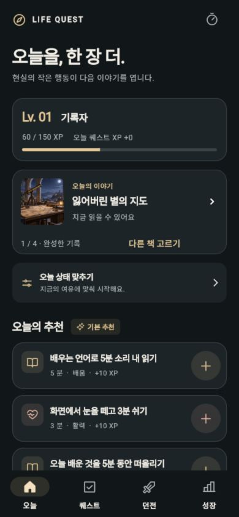
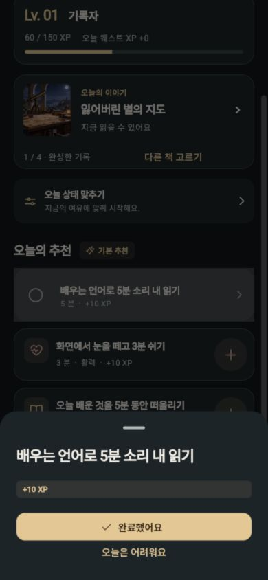
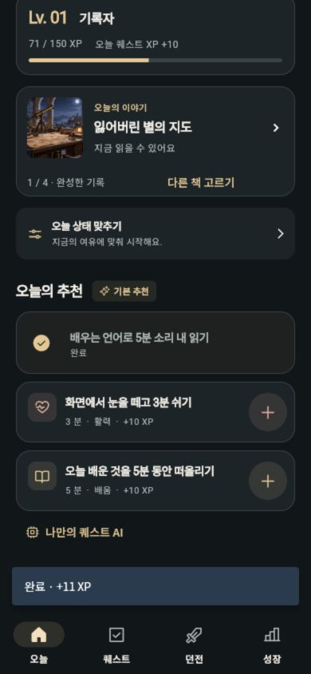
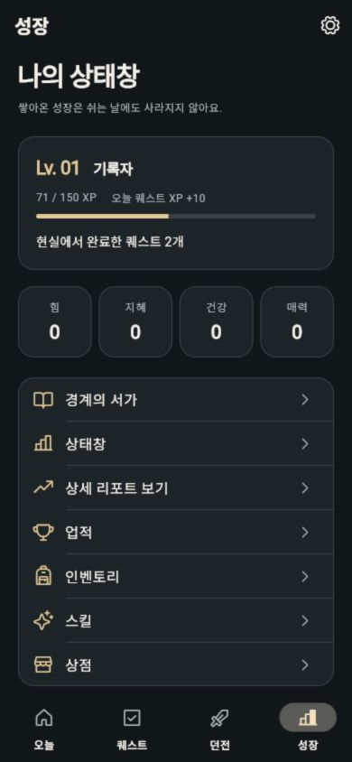
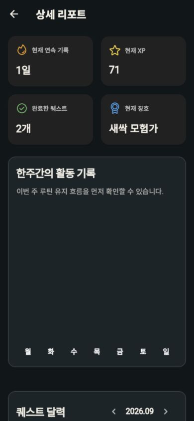
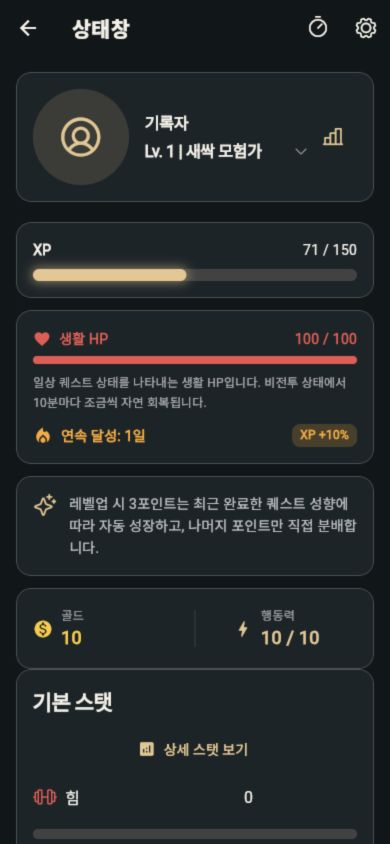

# 상태창 홍보 약속과 구현 대조 · 2026-09-21

## 판정

“웹툰 속 상태창이 내 일상에도 생긴다면? 오늘의 퀘스트를 완료하고, 어제보다 성장한 나를 확인하세요.”라는 문구에 **부분적으로 부합**한다. 퀘스트 수락/완료, XP, 레벨, 능력치가 있지만 첫 화면의 정체성·성장 피드백·기록 정확성은 이 약속에 못 미친다. 이 문구는 완성된 제품의 검증된 설명이 아니라 개선 목표로 다룬다.

## 확인 범위

기존 로컬 Flutter 웹 미리보기(127.0.0.1:8766)를 390×844로 조작하고, 현재 Flutter 소스와 대조했다. 이번 실행에서 직접 저장한 스크린샷만 사용한다. 기존 테스트 프로필의 시작값은 Lv1/60XP였으며 퀘스트를 한 번 완료했다. 실제 생활 행동·사용자 수요·유지율 기록이 아니다. 신규 온보딩, 실제 Android APK, 네이티브 진동/사운드, 온디바이스 추론, 결제는 이번 점검에서 검증하지 않았다. 기존 웹 빌드를 사용했으며 Android 배포 파일과의 바이너리 동등성을 검증한 것은 아니다.

## 흐름과 증거

| 단계 | 동작 | 상태 |
| --- | --- | --- |
| 1 | 기존 프로필로 오늘 화면 열기 | 상태 요약은 있으나 소개 문구와 이야기 배너가 서가 경험을 먼저 강조함 |
| 2 | 추천 퀘스트 수락 후 상세 열기 | 현실 행동과 기본 +10XP, 완료 버튼은 명확함 |
| 3 | 퀘스트 완료 | XP 60→71, 완료 알림 +11XP. 오늘 요약은 +10XP로 불일치 |
| 4 | 성장 탭 확인 | 레벨/누적 완료/능력치가 있음. 이번 완료 직후 능력치는 모두0, 변화 설명 없음 |
| 5 | 상세 리포트 확인 | 달력에는 오늘 완료가 있으나 주간 요약은0개. 어제 대비 능력치/레벨 차이 요약도 없음 |
| 6 | 상세 상태창 확인 | 칭호·XP·생활HP·스탯 등 존재. 오늘→성장→상태창으로 핵심 경험이 분산됨 |

### 1. 오늘 화면

“오늘을, 한 장 더.”와 “현실의 작은 행동이 다음 이야기를 엽니다.”가 첫 인상이다. 레벨/XP 카드가 보이는 것은 장점이나, 캐릭터의 현재 상태와 오늘 무엇이 성장하는지보다 이야기 진행이 앞선다. 상태창 판타지 독자의 기대에 맞는 첫인상인지는 개선이 필요하다. 소스: `lib/screens/today_screen.dart:83`, `lib/features/director/director_widgets.dart:69`.

### 2. 퀘스트 상세

할 행동, 보상, 완료/보류가 간단하다. 반면 어떤 능력의 성장에 연결되는지는 상세에서 설명하지 않는다. 이 단계에서 +10XP만 보이지만 실제 지급은 보너스까지 포함된다. 소스: `lib/screens/today_screen.dart:546`.

### 3. 완료 피드백

XP는 실제 증가했지만 순간적인 하단 알림만 보여 준다. 무엇이 어떻게 달라졌는지 다시 확인할 완료 기록이 필요하다. 오늘 요약은 기본 XP 합계이고 실제 XP는 연속 기록 등의 보너스를 포함한다. 따라서 이 테스트에서는 오늘 +10과 실제 +11이 갈렸다. 소스: `lib/state/character_state.dart:1138`, `lib/state/character_state.dart:771`, `lib/data/core_loop_rules.dart:183`.

### 4. 성장 탭

힘·지혜·건강·매력이 있지만 이번 행동 직후에는 모두0이다. 버그라고 단정할 수는 없다. 실제 구현은 완료 행동의 가중치를 쌓은 뒤 레벨업 시3포인트를 자동 배분한다. 이 규칙이 완료 흐름에서 드러나지 않아 사용자는 행동이 어떤 성장으로 이어지는지 알기 어렵다. 소스: `lib/state/character_state.dart:2782`, `lib/state/character_state.dart:1589`.

### 5. 리포트

주간 그래프는 비어 있고, DOM상 같은 화면의 오늘 달력에는 방금 완료한 퀘스트가 있다. `weeklyCompletedQuests`는 주 시작을 월요일0시가 아니라 현재 시각에서 요일 수만 빼서 계산한다. 월요일에는 방금 완료한 일도 조회 시각보다 과거라 제외된다. 이번 점검의0개 표시와 코드 원인이 일치한다. 소스: `lib/state/character_state.dart:855`. 어제 대비 스탯/레벨 차이를 한 번에 보여 주는 요약은 확인하지 못했다. 기존 주간/달력 통계 전체가 없다는 뜻은 아니다.

### 6. 상세 상태창

상태창의 재료는 충분히 존재한다. 칭호·XP·생활HP·골드·행동력·기본 스탯이 있으므로 “상태창이 없다”는 평가는 잘못이다. 다만 오늘/성장/상태창에 정보가 나뉘고, 같은 숫자를 반복해서 보게 된다. 이를 핵심 사용 흐름으로 정리해야 한다.

## 우선 수정

1. **성장 기록의 정확성:** 실제 지급 XP와 기본 XP를 명확히 구분하거나 실제 지급 기록으로 통일. 주 시작/종료 경계와 완료 기록 보존 검증.
2. **완료 후 변화:** 방금 한 행동, 실제 XP 보상, 관련 성장 기여와 다음 레벨까지 남은 양을 한 곳에서 보여 주기. 현재 코드에 레벨업 축하 효과는 있으므로 효과가 전혀 없다고 주장하지 않는다. 이번 실행은 레벨업 임계값을 넘지 않았다.
3. **오늘의 상태창 중심 재정리:** 상태→오늘의 퀘스트→완료 변화가 첫 경험. 서가/카드 탐험은 이를 지원하도록 배치. 특정 원작 UI 복제나 수제 SVG 아트 도입 없이 참고 자료와 생성 자산 원칙을 유지.
4. **어제와 오늘 비교:** 실제 저장된 기록으로 비교 가능하게 구현한 뒤 문구를 재검증. 인게임 수치를 실제 지능/건강 개선의 측정치라고 부르지 않기.

## 접근성 관찰과 한계

접근성 트리를 활성화한 뒤 탭·수락·완료 버튼을 이름으로 조작할 수 있었다. 상세 리포트의 달력 이동 버튼 둘은 트리상 이름이 비어 있었고, 완료 피드백은 일시적인 알림에 의존한다. 작은 보조 글자와 어두운 화면의 명도 대비는 추가 확인 대상이다. 대비 수치, Android TalkBack, 글자 확대, 운동 효과 선호를 실제 기기에서 시험하지 않았으므로 접근성 준수를 판정하지 않는다.

이번에는 평가와 기록만 수행했다. 앱 코드, 출시 파일, 스토어 등록정보는 변경하지 않았다.
