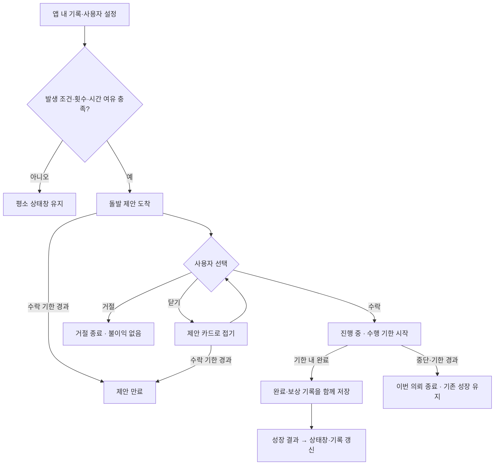

# 현실 상태창과 돌발 퀘스트 구조안 · 2026-09-21

**상태: 설계 초안. 구현하지 않는다.** 사용자는 기존 개선 항목에 웹툰/소설처럼 등장하고 수락·거절할 수 있는 돌발 퀘스트를 추가하도록 요청했다. 이 문서는 구조만 정리한다. 화면 코드, 데이터 모델, AI 프롬프트, 알림, 배포 파일은 변경하지 않는다. 횟수·시간·보상 예시는 초기 제안값이며 사용자 검증 결과가 아니다.

전체 개선의 기준은 [상태창 제품 전체 구조](STATUS_WINDOW_PRODUCT_STRUCTURE.md)다. 상태창 통합, 완료 피드백, 어제 대비 변화, XP와 주간 집계 수정을 함께 설계하며, 이 문서는 그 안의 돌발 퀘스트를 상세히 다룬다.

## 1. 제품의 중심

**내 현실의 행동에 반응하는 나만의 상태창.** 사용자가 고른 일상 퀘스트가 기본이고, 가끔 시스템이 새로운 기회를 제안한다. 실제로 행동하면 경험치와 성장 기록이 남는다. 오리지널 이야기와 서가는 그 행동에 의미를 더한다.

오늘 화면의 우선순위:

1. **내 상태:** 이름·칭호·레벨·XP, 오늘 쌓인 성장, 어제와의 변화.
2. **지금 할 퀘스트:** 수행 중인 돌발 퀘스트가 있으면 남은 시간과 함께 표시. 그 외에는 내가 수락한 일상 퀘스트.
3. **새로운 제안:** 돌발 퀘스트 도착 카드와 일반 추천. 수락 전에는 내 할 일에 포함하지 않음.
4. **성장 기록과 이야기:** 방금 한 행동으로 열린 변화/장면. 서가와 탐험은 별도로 깊이 들어갈 수 있음.

지난 감사의 XP 표시 불일치, 주간 집계 오류, 완료 피드백 부족은 이 구조의 선행 수정 항목이다. 새로운 이벤트가 부정확한 성장 기록 위에 쌓이지 않도록 한다.

## 2. 퀘스트의 역할 구분

| 종류 | 역할 | 발생과 선택 |
| --- | --- | --- |
| 일상 퀘스트 | 사용자가 자신의 하루를 운영 | 직접 생성하거나 기본/AI 추천 수락 |
| 돌발 퀘스트 | 예상하지 못한 작은 도전과 몰입 | 조건이 맞을 때 시스템 제안 → 수락/거절 |
| 연속 퀘스트 | 몇 번의 행동이 한 사건으로 이어짐 | 앞 단계 완료 뒤 다음 기회가 열림. 후속 단계도 선택 |
| 성장 도전 | 누적 활동의 이정표를 특별하게 표현 | 충분한 기록 뒤 제안. 기본 레벨업을 막는 필수 시험으로 쓰지 않음 |

**첫 범위는 일상 + 단발 돌발 퀘스트다.** 연속/성장 도전은 후속 확장이 가능한 자리만 남긴다. 여러 종류를 한 번에 구현하는 계획이 아니다. 달력 이벤트도 향후 같은 구조를 활용하되 실제 전 세계 사용자가 동시에 참여 중이라고 꾸미지 않는다.

## 3. 돌발 퀘스트의 한 번의 경험

### 등장

앱 안에서 ‘새로운 시스템 의뢰가 도착했습니다’라는 작은 알림을 보여 준다. 누르면 퀘스트 창이 열린다. 첫 체험에서 사용자가 선택한 경우에만 등장 연출을 자동으로 한 번 보여 줄 수 있다. 작성 중, 집중 타이머 중, 다른 결과창 위에 새 창을 겹치지 않는다.

퀘스트 창에는 다음을 같은 화면에 표시한다.

- 돌발 퀘스트 종류와 오리지널 사건 이름
- 짧은 서사 한 문장
- **실제로 할 행동과 완료 조건**
- 예상 수행 시간
- 수락 가능한 기한 / 수락 후 수행 제한 시간
- 확정된 보상과 관련 성장 분야
- 동등하게 찾을 수 있는 **수락 / 거절** 버튼

### 예시 — 기록의 잔향

> **시스템 · 돌발 퀘스트 발견**
>
> 배운 것을 자신의 말로 남길 기회가 열렸습니다.
>
> **목표:** 오늘 배운 내용을 한 문장으로 정리하기
> **완료 조건:** 정리를 마친 뒤 ‘완료했어요’ 선택
> **예상 소요:** 3분
> **수락 기한:** 오늘까지
> **수행 기한:** 수락한 때부터 20분
> **보상 예시:** 총 15 XP · 지혜 성장에 기여
>
> **[수락]　[거절]**

이 예시에서는 문장 내용을 서버에 제출하거나 AI의 정답 판정을 받을 필요가 없다. 앱에 기록을 남기는 기능이 추가되더라도 선택 사항으로 분리한다. 서사 문장으로 목표를 가리지 않는다.

### 수락 이후

수락하면 오늘 화면의 ‘진행 중’에 고정되고, 정한 시간이 그때부터 흐른다. 앱을 닫아도 시작 시각은 유지된다. 수락 시 실제 지급 보상을 확정하고 표시한다. 다른 화면에서 돌아와도 같은 의뢰를 이어간다.

완료하면 **행동 → 실제 보상 → 관련 성장 기여 → 다음 성장까지 남은 양**을 하나의 결과창에서 보여 준다. 레벨업이 실제로 발생한 경우에만 새 레벨과 능력치 배분을 함께 보여 준다. 이번 행동만으로 능력치가 오르지 않았다면 ‘지혜 +1’ 같은 숫자를 만들어 내지 않는다. 결과는 성장 기록에서 다시 볼 수 있다.

### 거절·미응답·중단

- **거절:** 제안 종료. 같은 날 새 돌발 퀘스트로 다시 권하지 않음. XP/레벨/기존 기록 손실 없음.
- **창 닫기:** 거절로 처리하지 않고 제안 카드로 접음. 자동으로 다시 열지 않음.
- **수락하지 않고 기한 경과:** 제안 만료. 실패 횟수로 세지 않음.
- **수락 후 중단 또는 시간 경과:** 이번 의뢰 종료, 이벤트 보상은 지급하지 않음. 기존 성장과 연속 기록을 깎지 않음.
- 취향이 아니라서 거절한 것인지, 지금 바빠서인지 알고 싶으면 종료 후 선택형 이유만 제공. 답변은 필수가 아님.

단순한 거절을 ‘사용자가 이 분야를 싫어한다’로 학습하지 않는다. 기본 효과는 빈도 조정이고, 분야 선호 변화는 명시적 이유나 반복된 신호를 충분히 구분해 반영한다.

## 4. 언제 발생하는가

완전 무작위 팝업 대신 **의미 있는 조건으로 후보를 좁히고, 가능한 후보 안에서 가끔 하나를 선택**한다. 사용자의 실제 앱 내 기록과 스스로 입력한 상태만 근거로 쓴다.

| 계기 | 가능한 의뢰 | 제약 |
| --- | --- | --- |
| 같은 관심 분야의 퀘스트를 몇 번 완료 | 방금 배운 것을 짧게 정리하는 마무리 의뢰 | 완료 결과창을 읽은 뒤 제안. 곧바로 다음 일을 강요하지 않음 |
| 사용자가 여유 시간과 컨디션을 직접 설정 | 그 범위 안의 2~5분 도전 | 일반 추천을 포함한 남은 시간 예산 안에서 선택 |
| 쉬었다가 다시 방문 | 짧은 복귀 의뢰 | 복귀를 비난하거나 밀린 퀘스트를 쌓지 않음 |
| 실제 누적 이정표 도달 | 기념 의뢰 또는 이야기 사건 | 최초 범위 이후 확장 후보 |

등장 조건의 ‘몇 번’, ‘몇 일’은 콘텐츠별로 정의한다. 최초에는 완료 기반·체크인 기반·복귀 기반의 짧은 템플릿만 준비한다. 타 앱 사용, 위치, 카메라, 마이크를 알아야 발생하는 조건은 이 설계에 필요하지 않다.

초기 제안값:

- **제안 노출 하루 최대 1회, 최근 7일 최대 3회.** 수락 여부와 무관하게 실제 노출을 센다. 반드시 이 횟수만큼 띄우지는 않는다.
- **제안 또는 진행 중인 돌발 퀘스트는 동시에 1개.** 수락 전후 상태를 합쳐 제한한다.
- 거절한 날은 남은 돌발 제안을 쉬고, 동일 템플릿은 최소7일 간격을 둔다.
- 첫 기본 퀘스트를 경험하기 전에는 무작위 제안을 넣지 않는다. 첫 돌발 체험도 횟수 한도에 포함한다.
- 수락 전까지 기한과 보상을 바꾸지 않는다. 여유 시간이 모자라면 제안을 만들지 않거나 아직 노출하지 않은 후보를 버린다.
- 사용자가 ‘돌발 퀘스트 쉬기/끄기’를 선택할 수 있다. 초기에는 앱을 열었을 때 발생하며 앱 밖 푸시 알림은 별도 후속 선택 사항이다.
- 닫기/거절 후 재접속, 새로고침, 시간대 변경으로 새 제안을 계속 뽑을 수 없도록 발생 기록을 유지한다.

## 5. 흐름과 상태

내부적으로는 `후보 → 제안됨 → 수락/진행 → 완료/정산`을 구분하고, 종료 이유를 `거절 / 미수락 만료 / 수락 후 시간 초과 / 중단`으로 보관한다. 후보를 계산한 것만으로 노출로 세지 않는다. 저장에 실패하면 완료 연출이나 보상을 확정 표시하지 않고 같은 건을 재시도한다.

## 6. 기존 앱에 연결하는 책임 구분

아래 이름은 설계상의 역할이며 새 파일이나 클래스를 생성하지 않았다.

| 역할 | 책임 | 기존 연결 지점 |
| --- | --- | --- |
| 발생 판단 | 허용 조건, 시간 예산, 빈도, 중복, 최근 거절 확인 | 현재 프로필/최근 피드백을 가진 `QuestDirectorState`와 연계 |
| 이벤트 템플릿 | 발생 조건, 실제 행동, 성장 분야, 시간/보상 한도, 원문/번역 | 일반 추천 템플릿과 구분된 콘텐츠 정의 |
| 온디바이스 개인화 | 적합한 세부 행동과 표현을 사용자 맥락에 맞춤 | `OnDeviceQuestModel`, 기존 생성 결과 검증 흐름 재사용 검토 |
| 의뢰 상태 관리 | 제안·수락·거절·기한·중단·복구 | 현재 추천의 `accept/skip`을 그대로 대체하지 않는 별도 상태 |
| 퀘스트 실행 | 수락한 의뢰를 한 개의 실제 퀘스트로 연결 | `Quest`, 오늘/퀘스트 화면 |
| 성장 정산 | 실제 지급 XP·레벨 변화·성장 기여·완료 시각을 한 번만 기록 | `CharacterState.completeQuest` 경로와 보상 기록 개선 |
| 표시 | 도착 카드, 상세, 진행, 결과, 재열람 | 오늘/성장 화면 재정리와 함께 연결 |

**현재 `QuestType`의 daily/weekly/monthly/yearly는 반복 주기이며 JSON에서 숫자 인덱스로 저장된다.** 돌발을 여기에 다섯 번째 반복 주기로 섞지 않는다. ‘발생 경로’와 ‘이벤트 연결 ID’를 별도 개념으로 설계하고 기존 저장본의 호환성을 보존한다. 이름이 event인 던전 내부 선택지와 현실 돌발 의뢰도 같은 기능으로 간주하지 않는다.

기존 일반 추천은 하루3개/설정 시간 예산을 사용한다. 돌발이 별도라는 이유로 여기에 일을 무제한 더하지 않는다. 발생 판단에서 일반 추천·진행 중인 과제의 시간을 함께 고려하고, 수락 시 중복되지 않게 남은 예산을 반영한다. 사용자 직접 생성 과제까지 모두 강제로 제한하는 기능은 아니다.

## 7. 저장할 최소 정보

| 묶음 | 필요한 정보 |
| --- | --- |
| 식별 | 이벤트 ID, 템플릿/규칙 버전, 사용자 로컬 프로필 범위, 연결된 퀘스트 ID |
| 발생 | 계기 종류, 발생 시각, 실제 노출 시각, 당시 지역 날짜/시간대, 제안 기한 |
| 내용 | 실제로 보여 준 언어·제목·행동·완료 조건, 예상 시간, 개인화/기본 템플릿 구분 |
| 진행 | 상태, 수락 시각, 수행 마감 시각, 종료 시각과 이유 |
| 보상 | 수락 시 확정한 총 보상, 기본/보너스 구분, 성장 분야/기여, 실제 지급 내역, 정산 ID |
| 선택 | 선택적 거절 이유와 취향 피드백. 원시 개인 목표를 이벤트마다 중복 저장하지 않음 |

완료 이벤트 ID와 정산 ID로 **한 의뢰 한 번 지급**을 보장하는 구조가 필요하다. 이벤트·퀘스트·지급 내역을 함께 저장하거나 복구 가능한 동일 작업 ID로 처리해야 한다. 재시작, 빠른 두 번 누름, 백업 복원 후 중복 지급은 사후에 고려할 부가 기능이 아니다.

수락 마감과 수행 마감은 별개다. 수행 마감은 수락 시 확정된 시각으로 판단하고 앱을 닫았다고 멈추거나 재설정하지 않는다. 날짜/시간대 변경은 진행 중인 마감과 보상을 재계산하지 않는다. 시계 불일치 시 보수적으로 새 제안 생성을 미루되 이미 얻은 성장을 차감하지 않는다. 오프라인만으로 모든 시계 조작을 완벽하게 막는다고 주장하지 않는다.

## 8. 온디바이스 AI의 역할

규칙 엔진이 **언제 / 몇 번 / 얼마 동안 / 어떤 보상 / 어떤 범위의 행동**인지 결정한다. AI는 사용자가 설정한 관심사, 가용 시간, 최근 완료/거절 이력 안에서 세부 행동과 자연스러운 사건 문구를 만든다. 단순히 제목만 바꾸는 개인화로 제한할 필요는 없지만, 실제 행동의 종류·난이도·시간은 검증 가능한 범위 안에 둔다.

- 검증된 템플릿의 행동 제약과 완료 조건을 유지한다. AI가 보상·마감·불이익·새 권한 요구를 임의로 만들지 못하게 한다.
- 새로운 제안은 공개 모델이 설치된 지원 기기에서만 선택적으로 개인화한다. 모델이 없거나 생성이 늦거나 결과 검증에 실패하면 준비된 현지화 템플릿으로 즉시 동작한다.
- 제안을 띄울 때 긴 생성 대기를 요구하지 않는다. 적절한 앱 사용 시점에 후보를 준비하고, 아직 준비되지 않았으면 기본 문구를 쓴다. 이미 노출/수락한 내용은 뒤늦은 AI 결과로 덮어쓰지 않는다.
- 앱을 강제 종료했다가 켜도 생성·노출·보상 기회가 늘어나지 않게 한다. 사용자 목표와 거절 기록을 클라우드 AI에 보내지 않는 현재 방향을 유지한다.
- 수행 여부는 기본적으로 자기 기록이다. 화면을 보고 있었다거나 감정/건강 상태를 실제로 측정했다고 허위로 표현하지 않는다.

## 9. 보상과 세계관

시간 대비 XP는 일상 퀘스트와 비슷하게 시작한다. 특별함은 도착 연출, 짧은 오리지널 사건, 실제 달성 기록과 선택적 장식에서 만든다. 돌발만 기다리는 것이 일반 퀘스트보다 훨씬 유리해지는 보상 구조는 피한다. 초안의15XP는 설명용이며 실제 보상표가 아니다.

무료 기본 돌발 퀘스트와 성장 기능을 유지한다. 기존 선택형 이야기/테마 팩은 앞으로 사건의 분위기와 표현을 확장할 후보가 될 수 있으나, 이번 설계로 새 유료 상품을 확정하거나 판매하지 않는다. 거절·실패 복구권, 재추첨권, 수락 기한 연장 과금은 이 구조에 넣지 않는다.

모든 시스템 메시지는 독자적인 표현을 쓴다. 특정 작품의 문구·전용 서열·캐릭터·패널 아트를 복제하지 않는다. 연출용 이미지가 필요해지는 구현 단계에는 기존 지침대로 생성 이미지 또는 권리가 확인된 자산을 사용한다. 이번에는 이미지나 화면 목업을 만들지 않는다.

## 10. 구현 승인이 난 뒤의 순서와 확인 항목

1. 성장 기록 정확성·주간 집계·완료 결과를 먼저 정리.
2. 실제 AI 없이 템플릿 기반의 단발 의뢰 하나로 제안→수락/거절→완료/만료→복구까지 검증.
3. 오늘 상태창에 연결하고 빈도·시간 예산·끄기·거절 동작 확인.
4. 기본 흐름이 안정되면 온디바이스 개인화 연결. 연속 사건과 성장 도전은 그 이후.

구현 시 확인할 기준: 거절이 한 번으로 끝나는가, 보상·마감이 수락 전에 명확한가, 기본/개인화 모드 모두 가능한가, 재시작/중복 클릭/날짜 변경에서도 상태와 보상이 일치하는가, 기한 이후 잘못 지급하지 않는가, 과거 완료 기록이 남는가, 지역 언어와 접근성 설정에서도 수락/거절을 이해할 수 있는가. 이번에는 테스트 코드나 실제 이벤트를 생성하지 않았다.
