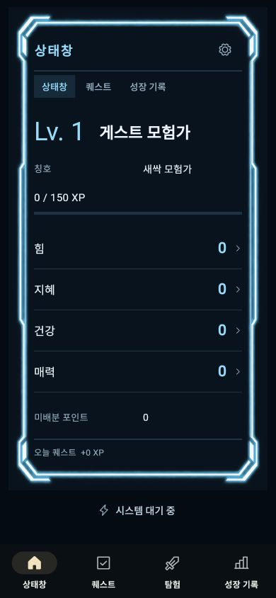
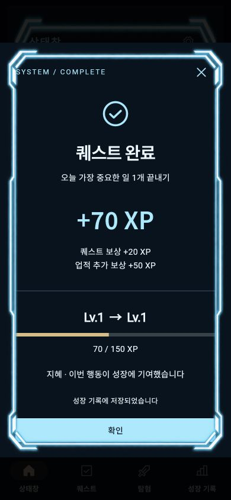
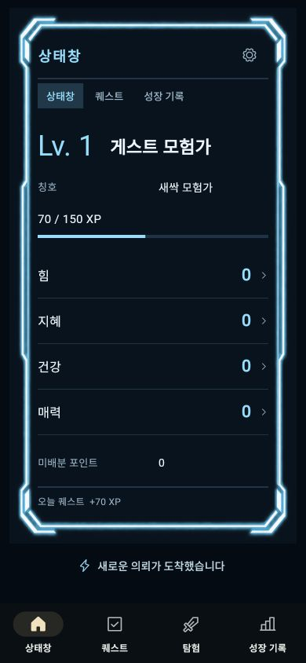

# 내 상태창 중심 첫 화면 구현 · 2026-09-27

사용자가 대량 조사 이후 실제 앱 구현 변경을 지시했다. 첫 화면은 개인 상태창 본체로 재구성했다. 이번 결과는 로컬 검토용이며 사용자 디자인 승인이나 Google Play 출시 완료가 아니다. 다음 작업은 이 문서부터 읽는다.

## 구현 결과

- `HunterStatusWindow`에 실제 이름·레벨·현지화된 장착 칭호·현재/필요 XP·힘/지혜/건강/매력·미배분 포인트·오늘 획득 XP를 배치했다. 상태/퀘스트/성장 기록은 패널 내부 메뉴로 동작한다. 추천 목록과 일정은 퀘스트 메뉴로 옮겼다.
- 능력치 행을 누르면 설명창이 열리고 기존 상세 상태/포인트 배분 기능으로 이어진다. 새 HP/MP·직업·등급·장비·스킬 획득을 꾸며 넣지 않았다. 상세 배분 화면 전체의 디자인 변경은 남아 있다.
- 진입은 360ms 페이드/확대이며 모션 감소 설정에서는 즉시 표시한다. 새 돌발 의뢰는 첫 화면 아래 작은 신호로 알려주고 기존 상세 수락/거절 창을 연다. 기존 발생·저장·만료·무벌점 처리는 보존했다.
- 퀘스트 완료 결과창도 같은 raster 프레임을 사용한다. 저장된 보상 내역과 XP를 표시하며 화면을 열었다는 이유로 XP를 더하지 않는다.
- [105개 IP 조사](../../research/status-window-100/README.md)의 개인 정보표·내부 명령·조회·결과창 원칙을 적용했다. 105개 모두의 실제 개인 상태창 그림을 검증했다는 의미는 아니다. 특정 작품 아트나 문장은 복제하지 않았다.

## 디자인 자산

`assets/images/ui/hunter_status_frame_v1.png`: image_gen으로 생성한 원본 RGBA PNG(1024×1536), 투명한 중앙과 청록색 테두리. 생성 결과를 가공 없이 복사했다. [프롬프트와 생성 기록](../../../../assets/images/ui/hunter_status_frame_v1.md)을 보존했다. SVG/HTML/Canvas로 일러스트를 제작하지 않았다. 앱의 실제 글자·버튼·레이아웃은 Flutter 위젯이다.

## 실제 앱 캡처

Web QA 프로필, 한국어, 390×844. 정식 계정과 분리된 합성 QA 데이터이며 사용자 반응이나 테스터 참여 기록이 아니다.

새 origin의 신규 프로필은 0/150 XP였다. QA 퀘스트 1개를 완료해 퀘스트 보상20+첫 업적50=70 XP가 저장되고 상태창에 반영됐다. 페이지 새로고침 후 QA 프로필을 다시 열어 70/150 XP 유지도 확인했다. 미리보기에 보이는70 XP는 이 검증에서 얻은 값이며 기본 지급/장식 값이 아니다.

## 검증과 설치 파일

- 최종 소스로 `flutter analyze --no-pub`: 문제 없음.
- 상태창·기존 모바일 레이아웃·시스템 연출·성장 기록 관련 25개 테스트 통과. KO/EN/JA/zh, 320px/200% 글자, 밝은 앱 테마 안의 어두운 패널, 실제 XP 업데이트, 내부 메뉴, 칭호 현지화, 모션 감소 포함.
- Web release 및 Android ARM64 release APK 빌드 성공. 이전 전체 테스트 통과 수를 이번 전체 재실행으로 주장하지 않는다.
- APK 서명 확인 및 생성 PNG 포함 확인. package `com.lifequest.app`, versionName `2.0.0`, 빌드 번호9. `--split-per-abi` 결과 ARM64 APK의 실제 versionCode는 **2009**다.
- 검토 파일: `build/review/life-quest-2.0.0-9-hunter-status-arm64.apk` (173.1MB).
- APK SHA-256: `ecfbe3c4c0cca518a435d91ac4fa4575723eac93e8b65d8765268eb778be21de`.
- 업로드 인증서 SHA-256: `1537d6f39ee3eed153e134128bbe661132183847ca3aa7f4b511276bfd352bb3`.
- 로그: `qa_artifacts/rebirth/hunter-window-{analyze,tests,web-build,apk-build}-20260927.log`.
- 로컬 미리보기: http://127.0.0.1:8768/ (`LIFEQUEST_QA_PREVIEW=true`). 브라우저 전용 임시 테스트 데이터다. 앱 Cloud/Billing 기본off 유지.

Android 실기 실행·TalkBack·성능 확인은 하지 못했다(연결된 Android 기기 없음). 기존 Gradle/AGP 지원 종료 예고 경고는 남아 있으나 빌드는 성공했다. Play Console 업로드/비공개 테스트 활성화/프로덕션 출시/SNS 게시/수익화 변경은 이번에 하지 않았다. pubspec 기본 버전2.0.0+7과 기존 공개판도 유지했다.

## 다음 작업

사용자가 이 첫 화면을 보고 지적하는 방향을 반영한다. 상세 능력치 배분/칭호 선택과 돌발 상세창의 시각 문법을 이어 맞추고, 실제 기기로 확인한 뒤 검토용 APK와 스토어용 AAB를 구분해 준비한다. v8은 거절된 디자인이며 v9도 테스트 통과만으로 디자인 승인으로 간주하지 않는다.

사용량 하한은 잔여70%. 이번 최종 단계 조회는 사용28%·잔여72%였으며 리셋 크레딧을 사용하지 않았다. 추가 작업 전 다시 확인한다.
