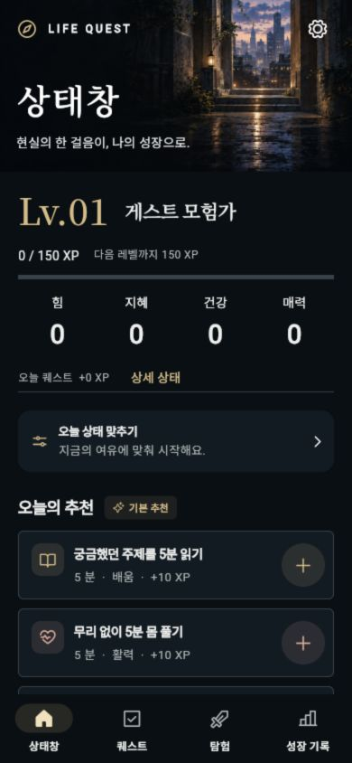

# 상태창이 제품의 본체 — 사용자 수정 반영

> **2026-09-27 최신 태블릿/수익화 검토:** 최신 요청은 휴대폰·태블릿 UI 수정과 실제 돈을 받을 수 있는 완성 앱의 배포 직전까지 작업이며, 무료 프리뷰/초안을 완료 단계로 계산하지 않는다. 잔여70% 하한 유지, 최종 조회 사용29%·잔여71%, 한도 확장 질문은 답변 대기/리셋 사용 없음. `docs/rebirth/design/status-system/TABLET_RELEASE_REVIEW_20260927.md`와 `docs/rebirth/MONETIZATION_READINESS_20260927.md`를 먼저 읽는다. 태블릿 raster 테두리의 글자 겹침, 상세 상태 큰 글자/배분/팝업, XpBar overflow 수정. 관련45·전체Flutter451통과/1skip·Cloud/Billing on 상품 테스트1통과·analyze clean. 서버의 앱 종료 후 구매 acknowledgment 복구를 private 작업 큐로 구현, 정책31통과(Node24 로컬, 원격Node22 미검증). 무료/유료 artifact 정책검사2통과, 실제 유료 AAB versionCode10의31검사 통과. 파일 `build/review/life-quest-2.0.0-10-paid-candidate.aab`는 Cloud/Billing on·Ads/QA off 후보이며 판매/출시 가능 판정이 아니다. 상태창 중심 새 유료 혜택의 구현/권한 연결, 가격/정산, Blaze/Auth/AppCheck/Play API/RTDN/private 큐 IAM, 실제 구매/복원/환불과 Android 실기, 제출 자료/Play 접근 검증이 남아 있다. 현재 Tide 단편과 핵심 상태창 구매 이유의 공백을 발견했고 확장팩은 권고/미구현이다. 수익성 불가능을 입증한 것은 아니며 우리 앱의 실제 매출/구매 전환은 없음. Play/Firebase 배포·상품 활성화·SNS·과금 계정 변경 없음. 완료 유료 출시라고 보고하지 않는다. 추가 작업 전 사용량과 사용자 하한 답변을 재확인한다.

> **2026-09-27 이전 v9 구현 기록:** 사용자가 조사 이후 앱 구현 변경을 명시적으로 지시했다. 사용량 하한은 **잔여70%**이며 아래5%/20%는 과거 이력이다. 최종 단계 조회 사용28%·잔여72%, 리셋 크레딧 사용 없음. `docs/rebirth/design/status-system/HUNTER_WINDOW_V9.md`를 먼저 읽는다. 첫 화면을 실제 이름·레벨·현지화 칭호·XP·4능력치·미배분 포인트의 개인 상태창으로 재구성했고, 퀘스트/성장 기록을 내부 메뉴로 옮겼다. 능력치 조회, 360ms 호출/모션 감소, 돌발 신호, 실제 보상 결과를 연결했다. 프레임은 생성 RGBA PNG이며 수제 SVG/HTML/Canvas 아트 없음. analyze 문제 없음·관련25테스트 통과·Web/ARM64 APK 최종 빌드 및 서명 확인. 검토 APK `build/review/life-quest-2.0.0-9-hunter-status-arm64.apk`(split ABI 실제versionCode2009). 신규 QA0XP→테스트 완료70XP→재진입70XP 유지 확인, 실제 사용자 반응 아님. 상세 배분 화면 전체의 시각 변경과 Android 실기 확인은 남아 있다. Play/SNS/수익화 변경 없음. v8 거절을 보존하고 v9 디자인 승인/출시 완료로 간주하지 않는다. 105개 IP 조사와 확인 수준은 `docs/rebirth/research/status-window-100/README.md`, `DESIGN_TRANSLATION.md`, `FOLLOWUP_20260927.md`에 유지했다. 코드가 포함된 최신 체크포인트를 아래 연구 전용 이력보다 우선한다. 추가 작업 전 사용량을 다시 확인한다.

> **2026-09-23 최신 요청:** 사용자가 ‘앱을 켜면 헌터가 되어 자신의 상태창을 연다’는 방향을 명시적으로 확인했다. 다음 단계는 약100개 작품의 상태창 조사이며 특히 웹툰의 실제 그림과 소설의 표현을 함께 비교한다. 한두 작품/나혼렙 편중이나 작품명만100개 채우기는 요구를 충족하지 않는다. 동일 IP의 웹툰/소설은 중복 집계하지 않고, 실제 패널 확인·본문 표현 확인·소개만 확인한 후보를 구분한다. 작품/공식 출처/회차 또는 위치/확인 수준/정보 배치/연출/앱 적용 원칙을 기록한다. 9/23 시작 조회 사용95%·잔여5%로 기존 하한에 도달했다. 이번 대량 조사는 아직 착수하지 않았으며, 한도 회복 또는 사용자의 하한 변경이 필요하다. 새 디자인 구현보다 이 조사가 먼저다.

2026-09-22. 디자인 요구 확정 및 다음 구현 기준. **재구현 완료 문서가 아니다.**

## 확인된 사용자 요구

- 사용자가 원하는 것은 현대 판타지 소설/웹툰 속 헌터가 직접 보는 상태창이다.
- 처음 보이는 상태창이 메인이다. 일정 관리 기능은 기본 하위 기능이다.
- v8의 장식 배경과 할 일 카드 중심 구조는 거절되었다. 이름만 ‘상태창’으로 붙이는 접근을 반복하지 않는다.
- 이전부터 특정 작품 하나에 치우치지 말 것, 이미지는 생성 또는 권리 확인된 무료 자산을 사용할 것을 지시했다.
- 사용량은 잔여5% 하한. 이번 시작 조회6%라 재구현은 시작하지 않고 재개 기준을 기록했다.

## 1. 현재 첫 화면 검토 — 방향 불충족

로컬 실행 앱 http://localhost:8767/ 의 한국어·390×844·게스트 QA 상태. 이번 검토에서 상단으로 이동해 새로 캡처했다. 첫 캡처는 중간 스크롤 위치여서 폐기하고 상단 화면으로 교체했다.

- 풍경/카피가 상단을 차지한다. 상태 수치는 레벨·XP·네 가지 능력치의 요약으로 끝난다.
- ‘상세 상태’를 누르도록 분리되어 있으며, 이어지는 화면은 컨디션 설정/추천 할 일 목록이다.
- 이름·칭호·능력치 분배·스킬을 살펴보는 상태 패널 자체가 메인이 아니다.
- 장점: 새 프로필의 XP0을 사실대로 표시한다. 이 데이터 정확성은 보존한다.
- 접근성 관찰: 보조 문구가 작고 어두워 읽기 어려울 수 있다. 새 디자인의 발광/반투명 효과는 가독성을 해치지 않아야 한다. 이번에는 첫 화면만 검토했으며 스크린리더·실기·전체 흐름 검증을 주장하지 않는다.

## 새 화면의 설계 제안

‘상태창 자체가 메인’은 사용자 요구다. 아래 항목 순서와 시각 표현은 그 요구를 실현하기 위한 제안이며 아직 확정된 시안/기능이 아니다.

1. 앱 진입 즉시 한 장의 독립적인 시스템 상태 패널이 열린다. 인사말/배경 풍경/추천 목록이 도입부를 대신하지 않는다.
2. 패널 안에 사용자 이름, 레벨, 현재 칭호, XP, 능력치와 미배분 포인트를 정돈된 행으로 배치한다. 스크롤 전에도 상태창의 전체 정체성을 알아볼 수 있어야 한다.
3. 칭호·스킬·장비는 상태창 내부의 하위 영역/탭으로 연결한다. 잠금/미획득은 사실대로 표시하고 가짜 획득 내역으로 채우지 않는다.
4. 퀘스트는 상태창의 명령 메뉴에서 연다. 진행 중 건수/새 시스템 메시지는 작게 알려주되 할 일 목록이 메인 상태 패널을 밀어내지 않게 한다.
5. 실제 보상 저장 → 시스템 결과창 → 바뀐 능력치/XP가 본체에 반영되는 순서로 연결한다. 돌발 퀘스트는 시스템 창으로 발생·수락/거절되며 기존 무벌점 원칙을 유지한다.

시각 방향: 정보가 정렬된 시스템 패널, 명확한 경계/프레임, 절제된 발광, 상태 항목의 규칙적인 간격, 상태/퀘스트/보상 창의 공통 시각 문법. 풍경 포스터·금색 세리프 타이틀·연속 카드 목록은 주된 표현에서 제외한다. 단순히 파란 네온으로 바꾸는 것만으로 완료 처리하지 않는다.

연출 방향: 최초 패널 호출, 정보 표시, 포인트 배분 미리보기/확정, 획득 알림, 레벨 상승. 반복 사용을 방해하지 않도록 짧게 설계하며 모션 감소를 제공한다. 연출 수치/길이는 다음 시안 단계에서 정한다.

## 데이터와 구현 연결

- `lib/screens/main_screen.dart`, `lib/screens/today_screen.dart`: 현재 메인과 오늘 중심 콘텐츠 분리 지점. 기존 화면 제목만 바꾸지 말고 구조부터 재구성한다.
- `lib/screens/status_screen.dart`: 현재 상세 상태 화면. 능력치 임시 배분과 칭호 선택 코드가 존재한다. 실제 동작/저장 경계를 다음 구현 전에 검토한다.
- `lib/models/character.dart`: name/level/title/xp/maxXp, strength/wisdom/health/charisma, statPoints/skillPoints가 존재한다. 새로운 민첩/감각/마력 등을 이름만 바꿔 기존 값에 끼워 넣지 않는다. 새 능력치 체계가 필요하면 성장 규칙/이전 데이터 이전을 함께 설계한다.
- 직업·헌터 등급·현실 HP/MP는 이번에 새 기능으로 확정하지 않았다. 장식용 거짓 값을 넣지 않으며, 기존 전투 HP/AP를 현실 건강/체력의 측정치처럼 표현하지 않는다.
- 기존 실제 XP 원장, 영속 저장, 돌발 수락/거절/만료는 보존한다.
- graphify CLI는 현재 PATH에 없어서 기존 graph.json 노드 위치를 직접 조회했다. 그래프는 이전 커밋 기준이므로 현재 소스와 실행 화면을 우선했다.

## 재개 시 순서와 완료 기준

1. 현재 사용량을 먼저 확인한다. 한도 리셋/추가 허용을 추정하지 않는다.
2. 여러 작품의 공식 공개 미리보기/영상에서 실제 상태 패널을 확보한다. 작품 소개만 읽고 상태창 디자인을 조사했다고 하지 않는다. 작품별 정보 배치/패널 경계/호출/보상 연출을 비교하고 확인 못한 부분을 구분한다.
3. 조사한 패널을 근거로 상태창 본체의 시안을 만든다. 필요 자산은 image_gen 또는 권리 확인된 무료 자산. 인물·문장·엠블럼·작품 패널을 제품에 그대로 복사하지 않는다. 수제 SVG/HTML/Canvas 그림은 사용하지 않는다. 실제 UI 텍스트/버튼/레이아웃은 Flutter 컴포넌트로 구현한다.
4. ‘이것이 원하는 상태창이다’라는 시각 방향이 잡힌 뒤 첫 화면/퀘스트/보상을 구현한다. 코드가 실행된다는 이유로 방향이 승인됐다고 주장하지 않는다.
5. 기본 글자 크기의 모바일 첫 화면에서 사용자 정보·레벨·주요 능력치·칭호/스킬 진입이 중심이고 일정 목록은 전면을 차지하지 않아야 한다. 큰 글자에서는 패널 스크롤을 허용하고 잘림을 막는다.
6. 신규/성장/복귀 상태, 실제 XP/포인트 배분 저장, 수락/거절, 모션 감소, 한·일어 가독성을 확인한다. 사용자가 거절한 v8을 완성 디자인으로 출시하지 않는다.

이번 변경: 이 문서와 우선순위 메모, 검토 캡처만 추가했다. 앱 코드·빌드·Play·SNS 게시 변경 없음. 이전 427개 테스트 결과는 이전 코드 검증이며 새 디자인 검증이 아니다.
