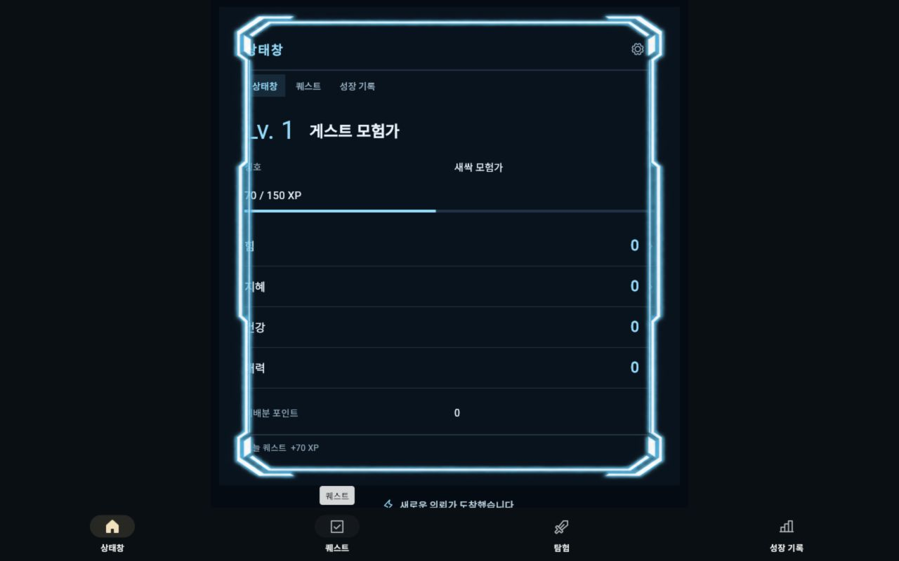
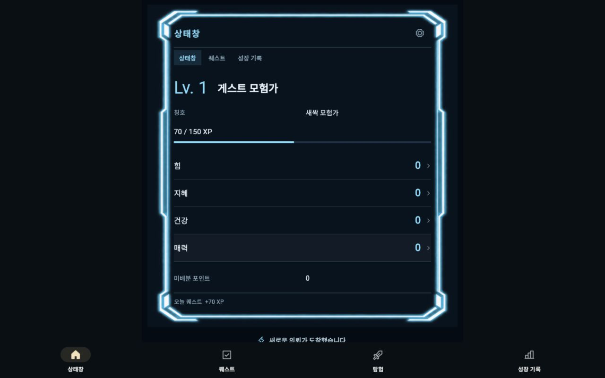
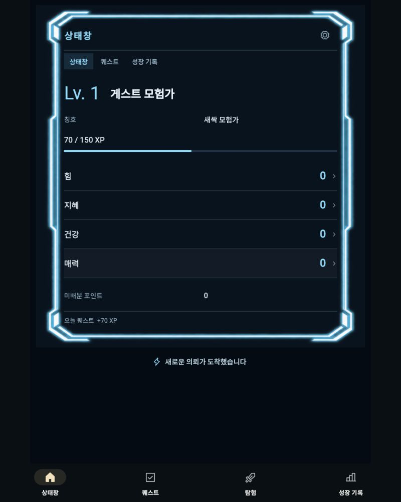
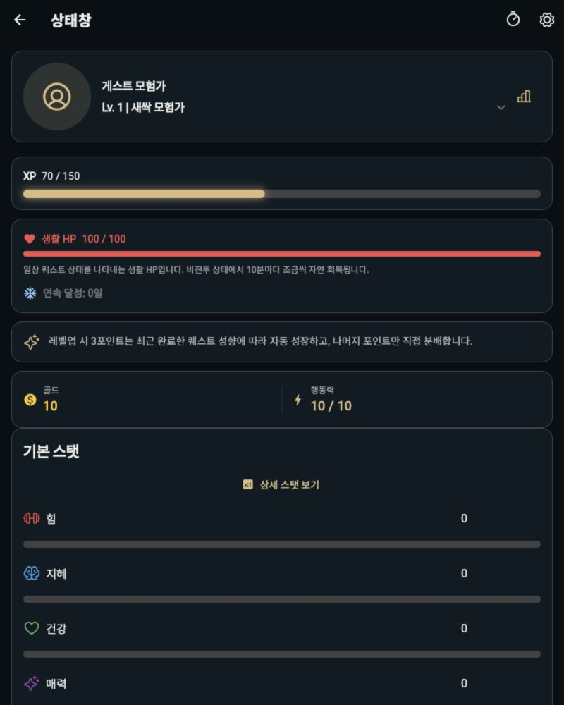
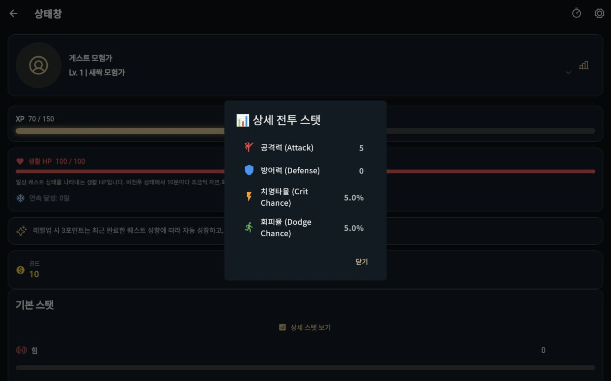

# 휴대폰·태블릿 검토와 유료 후보 빌드 · 2026-09-27

최신 요청은 화면 깨짐 수정, 돈을 받을 수 있는 완성 출시의 가능성 판단과 배포 직전까지의 준비다. 무료 프리뷰·신청 폼·초안·컴파일 성공을 수익화 완료 단계로 계산하지 않는다. **이번에도 완성 유료 출시 준비 완료 판정은 아니다.**

## 화면 검토

1. **내 상태창 — 겹침 수정.** 태블릿에서 PNG 테두리를 가로로 늘리면 고정36px 여백 안의 글자를 덮었다. `HunterSystemFrame`에 폭의8.5% 이상을 확보하는 수평 안전 여백을 적용했다. 기존 생성 PNG를 사용하며 새 SVG/HTML/Canvas 아트를 만들지 않았다. 1280×800의 같은 QA 프로필/배율에서 전후를 캡처했다.
2. **상세 능력치·배분 — 큰 글자 수정.** HP/연속 기록/SP 헤더 줄바꿈, 좁은 골드/AP 카드의 세로 배치, 능력치 라벨/수치의 유연한 폭과48px 조절 버튼을 적용했다. 실제 배분·취소·저장 동작을 검증했다. 공통 `XpBar` 헤더에서320px/200%일 때 발생한0.25px overflow도 줄바꿈으로 해소했다.
3. **상세 전투 스탯 팝업 — 닫기/스크롤 가능.** 내용에 스크롤을 적용하고 가로 태블릿에서 팝업과 닫기 버튼을 캡처했다. 4언어 큰 글자의 대화상자 열기/스크롤/닫기도 테스트했다.
4. **구매·복원·환불 — 실제 검증 미완료.** 아래는 결제 후보 빌드와 정책/상품 테스트다. Play 실결제 화면·정산·실물 기기·라이선스 거래를 통과했다는 뜻이 아니다.

### 1. 태블릿 가로 상태창: 수정 전 → 후

### 2. 태블릿 세로 상태창·상세 상태

### 3. 태블릿 가로 상세 팝업

모두 이번 실행의 Flutter Web QA 캡처다. 가로1280×800, 세로 캡처800×1000. 800×1280 세로는 자동 테스트로 확인했으며, IAB의 긴 viewport 캡처가 잘려 시각 증거는800×1000으로 다시 얻었다. 잘린 초기 세로 캡처는 완료 증거로 사용하지 않는다. QA의70XP는 이전 테스트 퀘스트 완료 보상이며 실제 사용자 참여/매출이 아니다. `adb devices`에 연결된 Android 기기가 없어 Android 실기·키보드·TalkBack·AI 발열/배터리 검증은 미완료다. 전체 앱의 모든 화면이 모든 크기에서 무결하다고 주장하지 않는다.

## 검증

- 관련45개 테스트: 상태창/메뉴/실제 XP, 상세 배분/저장/팝업, 시스템 연출/기록. 휴대폰320×900, 태블릿800×1280/1280×800, KO/EN/JA/zh와200% 글자 포함.
- 전체 Flutter451통과·1skip. 기본off로 skip된 상품 목록 테스트는 Cloud/Billing on 별도 실행에서1통과했다. 실제 결제 거래를 모사한 단위 테스트이며 Play 구매 검증 완료가 아니다.
- `flutter analyze --no-pub`: 문제 없음. Web release 빌드 성공.
- 서버 정책31개 통과(Node24.19.0). 배포 설정은 Node22이며 실제 원격 Node22 런타임/큐/IAM은 검증하지 않았다.
- 무료/유료 manifest permission profile 테스트2개 통과. paid profile은 BILLING을 요구하고 광고/광범위 앱 조회 권한을 거부한다.
- 로그는 `qa_artifacts/rebirth/tablet-*-20260927.log`에 보존했다. `git diff --check` 통과.

## 구매 확인 복구 코드

검증된 미확인 구매의 복구 작업을 큐에 먼저 저장하고 권한을 지급한다. 즉시 acknowledgment가 실패해도 앱 종료와 무관하게 비공개 작업이 재검증/재시도한다. 중복 지급·삭제 계정·환불·이전 구매 작업과 새 구매 권한을 검사했다. [구현 및 배포 요건](../../../../functions/ACKNOWLEDGEMENT_RECOVERY.md)을 따른다. 작업 큐/IAM/비용 계정 배포와 실제 구매 후 앱 종료 시험이 남아 있다. 구매 토큰을 로그/공개 문서에 기록하지 않는다.

## 제출 후보 파일

`build/review/life-quest-2.0.0-10-paid-candidate.aab`: 로컬 유료 후보. Cloud=true, Monetization=true, Ads=false, QA=false. package `com.lifequest.app`, versionName2.0.0, versionCode10,236,005,254bytes. 기존 공개판과 pubspec 기본2.0.0+7은 바꾸지 않았다. Play/Firebase 배포와 상품 활성화도 하지 않았다.

`scripts/inspect_release_artifact.py --profile paid`로31개 실제 AAB 검사 통과: 예상 업로드 인증서/서명, BILLING 포함/광고 제외, 기본 자동 수집off, native16KB ELF 정렬, ARM64 AI JNI, 모델 별도 다운로드 포함. 기기별 APK 다운로드 크기/실행 검사는 이번에 하지 않았다.

SHA-256: `c595677f553100f82eb7861fb9407b7255707d47bcc43dfa429210b0fc02deac`.

검사 결과: `qa_artifacts/rebirth/tablet-paid-artifact-inspection-20260927.json`. 이 파일을 외부 서비스/거래 검증 없이 출시하지 않는다.

## 수익화 판단과 아직 필요한 작업

[수익화 조사와 코드/계정 검토](../../MONETIZATION_READINESS_20260927.md)가 기준이다. 카테고리에는 실제 유료 상품이 있지만 Life Quest의 구매 전환/수익성은 입증되지 않았다. 현재 주력 Tide 단편과 ‘나의 상태창’ 구매 이유 사이에 공백이 있다. 상태창 외관·성장 분석·저장 가능한 요약을 묶는 일회 확장팩은 권고이며 **아직 구현되지 않았다**. 이를 이미 제공하는 상품이나 확정 가격으로 표시하지 않는다.

남은 완성 작업은 상태창 중심 유료 혜택의 실구현/권한 연결, 확정 가격과 판매자 정산, Blaze 및 Auth/AppCheck/Play API/RTDN/작업 큐의 실제 구성, 라이선스 구매/복원/환불/삭제 검증, Android 실기 및 제출 자료 검수다. 9/21의 프로덕션 접근 제한/Alpha 비활성 기록은 이번에 콘솔 재확인하지 않았으며 실제12명/14일·심사 요건을 가짜 기록으로 해결할 수 없다.

사용량은 마지막 작업 중 조회 사용29%·잔여71%. 기존 잔여70% 하한을 유지하며 추가 사용 범위 질문은 답변 대기였다. 리셋 크레딧 사용 없음. 최종 사용량은 재개 메모의 최신 조회를 따른다.
