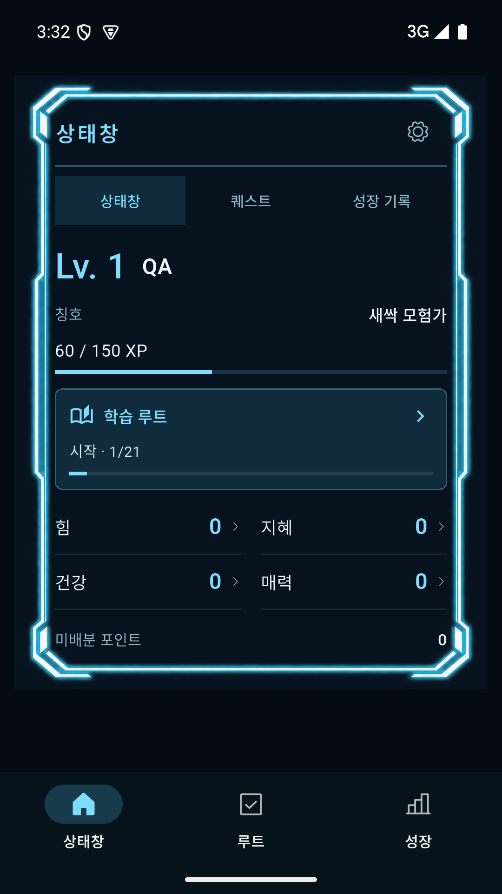
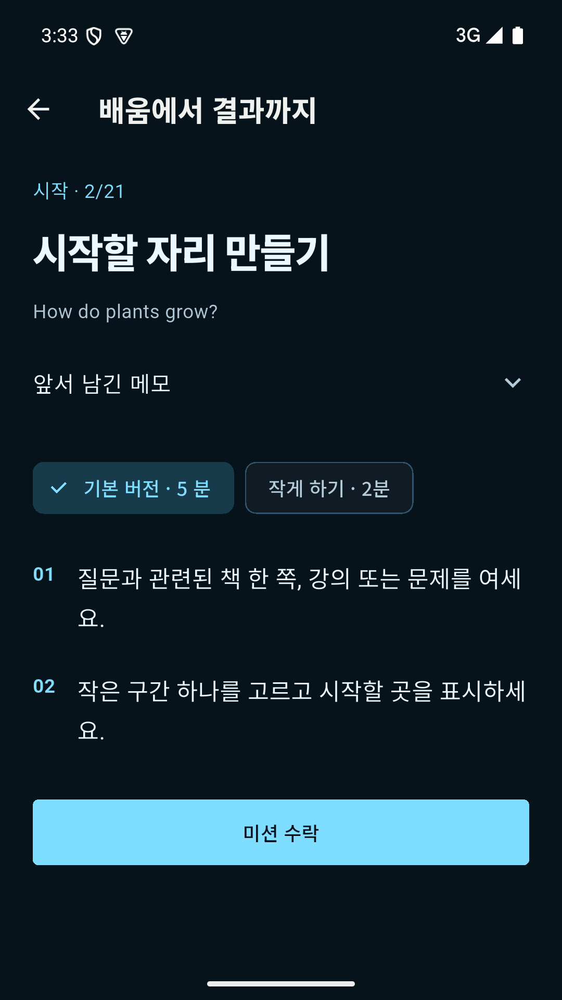
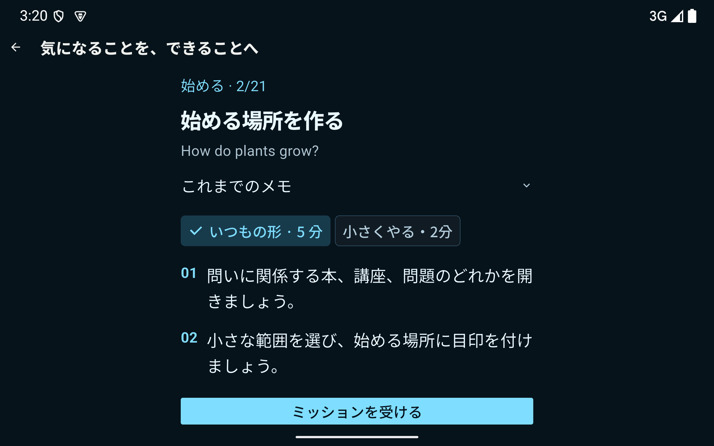
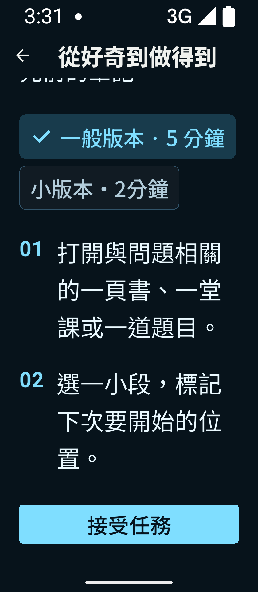

# 2.1.0+2014 제품 동작·화면 검증 · 2026-10-03

이번 작업에서 직접 설치한 signed release APK와 Android API35/16KB 에뮬레이터의 화면이다. 합성 `QA` 프로필만 사용했다. 실제 이용자, 실제 학습 성과, 구매 수요를 나타내지 않는다. 수제 SVG/HTML/Canvas 아트는 추가하지 않았고 기존 생성 raster 상태창 프레임을 이용했다.

## 증거 구분
- `02–03`: 이번 작업 시작 전 앱의 진입/0 XP 기준 화면.
- `09–12`: 이번 세션 중 첫 구현본의 실제 타이머→강제 종료→재진입→완료 흐름. 후속 색상/목표 수정/유료 미리보기/번체 변경 전 이력이다. 최종 APK에서 이 전체 과정을 다시 실행한 증거로 쓰지 않는다.
- `40–46`: 최종 기능 수정 뒤, 번체 Material 안내 수정 **직전** APK `fe5affdc19bccfdebb08546be849e1207bd35e633d91e0b54b17b68608513f89`. 일본어 상태/루트/미션, 태블릿200%, 유료 미리보기 경계.
- `48–53`: 최종 APK `2ac422ad8b85558815e523ee5805040f260e853dcfaa270fdab1da0470e587db`. 번체 기본 안내 수정 뒤의 Android 실제 화면. 한국어/번체 상태창과 미션, 작은 화면200% 및 스크롤 후 수락 버튼. `53`은 에뮬레이터의 합성 QA 데이터만 초기화하고 새 온보딩을 완료한 **0 XP / 0/21** 첫 상태창이다. 사용자 기기나 실제 계정 데이터는 초기화하지 않았다.
- 중간 전환 애니메이션, 런처, ADB 편집 중 합성 목표가 잘못 입력된 화면은 채택하지 않았고 `/tmp/lifequest-2014-intermediate-captures`로 옮겼다. 태블릿 크기/배율은 검증 후 에뮬레이터 기본값으로 복원했다.

## 확인한 흐름과 수정 결과
1. **내 상태 확인:** 이름·레벨·XP·선택한 루트·네 능력치가 먼저 나온다. 루트 카드를 눌러 진행 위치로 갈 수 있다. 능력치는 한 열의 긴 목록에서 두 열로 정리해 현재 루트를 함께 볼 수 있게 했다. 스크린샷의60 XP는 첫 합성 미션10 XP와 첫 완료 업적50 XP의 결과이며 미리 채운 시작값이 아니다.
2. **할 행동 선택:** 네 루트 목차에서 무료 첫7개와 전체21개를 구분한다. 미션의 단계·목표·구체적인 두 행동이 이어지고, '작게 하기'는 별도로 작성한 실제 행동으로 바뀐다. 휴식 뒤에도 날짜로 루트 진도를 초기화하지 않는다.
3. **실행 도움:** 수락 뒤 타이머를 선택할 수 있다. 첫 구현본의 실제05:00→앱 종료→03:44 재진입을 확인했다. 타이머는 보조 도구이며 완료/XP를 자동 생성하지 않는다. 타이머의 재시작·일시정지·저장 범위는 최종 자동 검사에도 포함됐다.
4. **결과와 다음 단계:** 사용자가 완료하면 메모·진도·XP 영수증을 함께 저장하고 다음 미션으로 이동한다. 자동 검사에서 저장 실패 재시도, 중복 보상 방지,21단계 완료 후 보관/새 목표,백업 복원,자정 지나기,기존 Plus 권한을 확인했다.
5. **구매 전 판단:** 전체 목차와 각 루트8번째 미션의 실제 안내를 무료 예시로 확인한다. 다른 후속 안내는 Complete 권한이 필요하다. 이미 완료한 메모를 환불 뒤 숨기지 않는다. 구매 페이지는 실제 가격 미조회 시 구매 성공/가짜 가격을 만들지 않는다. **실제 Play 상품 조회·결제·복원·환불은 미검증**이라 이 부분은 통과 처리하지 않았다.
6. **화면 접근:** KO/EN/JA/zhTW의 상태·라이브러리·루트·미션·타이머·유료 페이지를 320×740,800×1280,1280×800 및200%로 위젯 검사했다. 실제 에뮬레이터에서도 일본어800dp 세로/1280dp 가로200%, 번체320dp200%를 확인했다. 좁은 화면은 세로 스크롤을 허용하며 버튼이 도달 가능하다. 번체 앱의 Material 기본 안내가 간체였던 문제는 `zh-Hant-TW` 해석으로 수정하고 실제 접근성 트리에서 확인했다.

## 채택 화면

추가 증거: [루트 목록](41-final-library-ja.png), [무료 예시](45-final-free-sample-ja.png), [유료 경계](46-final-paid-preview-ja.png), [타이머 재진입](10-focus-reopened.png), [실제 보상](11-completion.png), [다음 미션](12-next-mission.png).

## 검증 결과와 한계
- 전체 Flutter: **569 통과/1 의도적 skip**. 기본 플래그에서 생략되는 라이브 카탈로그 분기는 Cloud/Billing on 관련42검사에서 확인했다.
- `flutter analyze --no-pub`: 오류 없음. Functions 정책50검사, Firestore/Storage 실제 로컬 emulator12검사 통과.
- release AAB·APK 빌드, APK 서명/16KB ZIP 정렬, AAB manifest/공개 인증서/ELF/기기 split 검사40개 통과. [최종 파일 검사](../../../../product-2014-inspection.json).
- 실물 Android, 제조사별 키보드/접근성, TalkBack 전체 흐름, 장기 사용/자발적 구매, 운영 서버/Play 금융 경로는 이 화면 검사로 보증하지 않는다. 테스트에서 오류가 없었다는 결과를 완벽한 제품·수익성 확정으로 바꾸지 않는다.

기능·콘텐츠·판매 경계는 구현됐지만 실제 구매/복원/환불이 미완료이므로 전체 사용자 목표 완료나 판매 가능 최종 판정은 아직 하지 않는다. 남은 외부 연결은 [Complete 검증표](../../../../store/COMPLETE_PRODUCT_2014.md)를 따른다.
