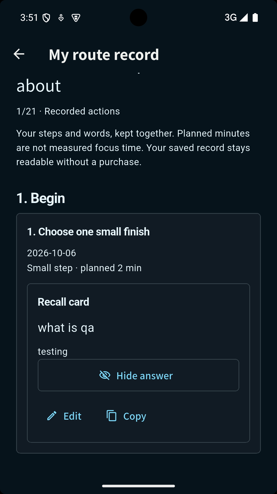

# Android 2017 미션 도구·저장 직접 검사 · 2026-10-06

2017의 새 미션 도구를 실제 Android 앱에서 조작했다. 이전 웹/위젯 검사 및 Android 설치 확인과 다른 범위다. 전용 API35·16KB 에뮬레이터의 로컬 합성 프로필 `QA toolkit`을 사용했다. 고객의 실제 행동, 구매 수요나 매출 증거가 아니다. 본인 휴대폰의 Play 구매·복원·환불은 [별도 기록](../play-test-purchase-20261006.md)을 따른다.

## 파일과 환경

- 패키지 `com.logian.lifequest`, 설치 확인 versionName2.2.0 / versionCode2017 / target36 / min26. AVD `LifeQuest_API35_16KB`, 페이지 크기16384.
- 앱 소스 `21380b0012d147a641a36980af957a97856c6187`. APK `build/review/life-quest-2.2.0-2017-save-recovery.apk`, SHA256 `6eda7428b7535eedb08cf9da074a61e317195a33cc700fd143d48ecd716220dd`.
- 기본 영어·기본 글자 크기, 세로와 회전한 가로 화면. 기기 UI 조작은 CUA로 수행했다. ADB는 설치/패키지·프로세스 메타데이터 확인에만 사용했고 입력·UI 덤프·스크린샷에는 사용하지 않았다.
- 별도의 Google 로그인이나 구매 권한 부여 없이 무료 학습 첫 미션을 검사했다. 메인 상태창·상품·서버 소스 변경 없음.

## 실제 확인 결과

| 흐름 | 확인한 결과 |
| --- | --- |
| 새 프로필 | 이름 `QA toolkit`, Lv1,0/150XP, 네 능력치0. [초기 화면](phone-status-zero-xp.png). |
| 무료 첫 미션 | 학습 루트 `Choose one small finish`를5분으로 수락. 복습 카드 질문 `what is qa`와 답변 `testing`을 직접 입력했다. |
| 초안 재진입 | 미션을 나갔다 다시 열어 질문10자/답변7자 보존을 확인했다. |
| 수락한 미션 축소 | 5분을2분으로 줄인 뒤 질문/답변이 그대로 남았다. 지침은 작은 행동으로 변경됐다. |
| 초안의 프로세스 종료 | Android 앱 정보의 Force stop으로 종료하고 프로세스가 없음을 확인했다. 재실행한 새 프로세스에서2분 수락과 두 필드가 복구됐다. [재시작 뒤 초안](phone-draft-after-process-restart.png). 단순 화면 재진입으로 대체하지 않았다. |
| 완료/보상 | 합성 QA 미션을 한 번 완료했다. 미션10XP + 첫 완료 업적50XP = 총60XP,0→60/150을 별도 표시했다. [보상](phone-first-small-mission-reward.png). |
| 다음 행동 | 루트1/21과 다음2번 `Make starting easy`를 확인했다. 기록은 작은 행동·계획2분이며 실제 집중 시간으로 표시하지 않는다. |
| 무료 결과 재사용 | 내 루트 기록에서 질문을 읽고 답을 펼치고 가렸다. 그 뒤 상태창60XP로 추가 보상이 없음을 확인했다. |
| 완료 기록의 프로세스 종료 | 완료 후 다시 Force stop, 프로세스 부재 확인, 재실행. [60XP·진도1/21](phone-status-after-completion-restart.png)과 [질문/답변이 있는 기록](phone-record-after-completion-restart.png) 모두 복구됐다. |
| 짧은 가로 화면 | 상태창 하단·루트 버튼·기록·카드 답변·수정/복사 버튼에 스크롤로 접근했다. 카드와 버튼의 글자 겹침/가로 넘침을 발견하지 않았다. [가로 카드](landscape-toolkit-readable.png). 방향은 세로로 복원했다. |

Gboard의 스타일러스 입력 도구 때문에 IDE 키보드 입력이 Android 필드로 전달되지 않았다. 화면 키보드로 입력해 실제 저장을 확인했으며 이를 앱 입력 결함으로 기록하지 않았다. 회전 중간 화면은 가로 레이아웃의 증거로 쓰지 않고, 회전이 끝난 화면과 실제 스크롤/버튼 동작을 검사했다.

## 원본 Android 화면

위 PNG는 Android Studio의 Take Screenshot/Save에서 내보낸1080×1920 원본이다. 생성 이미지/웹 모형/이미지 편집이 아니다. SHA256 `d8c9a66a973d53a2e28d9aa7440ee55e76aad1dcae39155b1d5894cdb6065eba`. 기록 화면은 스크롤 중인 위치라 목표 제목 일부가 위로 지나간 상태다. 다른 여섯 PNG는 기기와 IDE 주변을 포함한 CUA 캡처다.

## 구매 권한 회수 후 기록의 자동 검사

`journey_tool_test.dart`에 실제 사용자 데이터와 분리된 회귀 검사1개를 추가했다. Complete로 학습 루트8번째 미션까지 완료하고 권한을 회수한 뒤, 새 유료 미션은 수락 불가/기존 루트·메모·도구·XP 보존을 확인했다. 이미 만든 유료 단계의 카드는 미보유 상태에서도 수정 가능하며 재실행·백업의 프로필 직렬화/복원 이후에도 남고, 권한은 백업에 포함되지 않는다. 수정/재사용에서 추가 XP 없음. 해당 파일의 총14개 검사 통과(네 언어320/1280dp·200% 도구 UI 포함). 앱 기능 소스와2017 바이너리는 변경하지 않았다.

이 자동 검사는 로컬 저장·권한 분리의 근거다. 실제 Google Play 환불 후 본인 휴대폰의 기존 기록이 남았다는 증거로 바꾸어 말하지 않는다.

## 판단과 한계

이 검사에서 새 Android 결함은 발견하지 않았다. 앱 기능 소스 수정/재빌드가 없어 기존 전체603/기존1skip·Cloud/Billing관련37·analyze clean·아티팩트40검사는 같은 앱 소스의 결과로 유지한다. 위 회귀 검사를 추가한 도구 파일14개 통과는 별도 후속 결과이며 전체604개를 다시 실행한 것으로 기록하지 않는다. 검사 통과를 실제 고객 성과나 흑자 보증으로 확대하지 않는다.

이 세션은 영어 네이티브 전화/가로 표본이며 전체 제조사·TalkBack·새 네이티브 태블릿/200% 글자 검사를 뜻하지 않는다. 네 언어320/1280dp·200% 위젯 및 실제 웹 태블릿 검사는 [10/4 기록](../toolkit-20261004/README.md)을 별도 근거로 사용한다. 본인은 환불 후 기존 무료 기록 보존 질문에 ‘모름’으로 답했다. 해당 결과는 미확인이며 이 로컬 무료 프로필의 보존 검사를 그 사실로 바꾸어 말하지 않는다.

외부 테스터 등록/비공개 트랙 게시/판매자 연락·결제는 하지 않았다. 본인 한 명의 내부 테스트는 계속 승인됐지만 외부 비공개 배포는 사용자의 최신 지시대로 보류한다.
